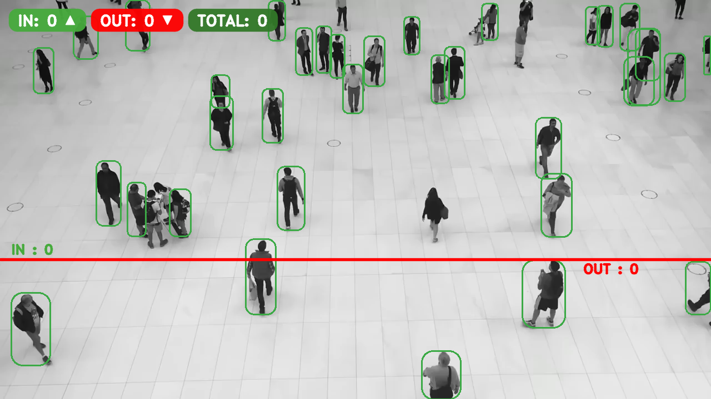
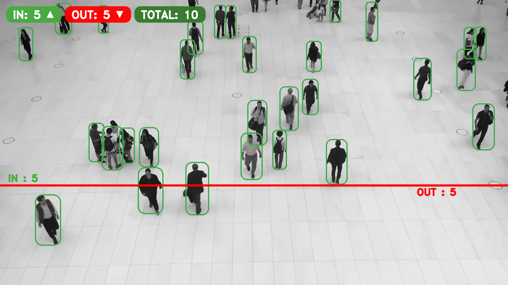
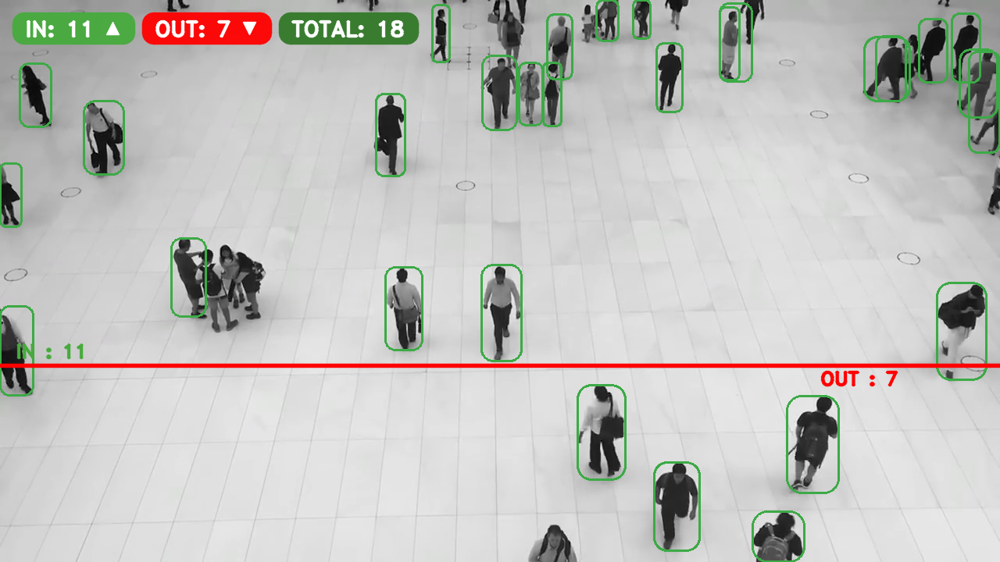

# Footfall Counter — YOLOv8n + ByteTrack + Supervision

**Author:** Thanan Cariappa K R

This project counts people crossing a virtual line in a video. It uses **Ultralytics YOLOv8n** for person detection, **ByteTrack** for multi‑object tracking, and a robust **crossing counter** so counting starts immediately (even near frame corners). The counter drives the **top banner** and the **ROI line labels**, so the numbers always match.

> **New in this version**
> - **Per‑ID trajectories** (polylines) to visualize paths
> - **Live heatmap** overlay (decays over time) for crowd density
> - **FastAPI microservice** with:
>   - `POST /upload-video` → returns counts & a rendered output file
>   - `GET /stream?source=...` → MJPEG live stream with overlays (webcam, file, or RTSP)
> - Choose **webcam** (`--source 0`) or **local/RTSP** via CLI & API

---

## Repository

Clone this project from GitHub (example):
```bash
git clone https://github.com/thanan2002/footfall-counter-yolov8.git
cd footfall-counter-yolov8
```

---
## Repository

Clone this project from GitHub:

```bash
git clone https://github.com/thanan2002/footfall-counter-yolov8.git
```

## Video Source

- **File:** `mall_counting.mp4` (sample mall corridor video)
- **Alternative:** Any local video path
- **Webcam:** `--source 0`
- **RTSP:** `--source "rtsp://user:pass@ip:554/stream"`

---

## Screenshots (auto‑saved to `outputs/`)

After a run you’ll find three images saved automatically:

- `outputs/snap_001.png`  
- `outputs/snap_002.png`  
- `outputs/snap_003.png`

You can embed them like:

```markdown



```

---

## Requirements

- Python **3.8+**
- Packages:
  - `ultralytics`
  - `supervision`
  - `opencv-python`
  - `numpy`
  - `fastapi` (for API)
  - `uvicorn[standard]` (for API)

Install (classic `pip`):
```bash
pip install -r requirements.txt
```

Install (with `uv`, optional):
```bash
uv pip install -r requirements.txt
```

---

## Usage — CLI (process a file or webcam)

Basic (local file):
```bash
python app.py --source mall_counting.mp4
```

Webcam (index 0):
```bash
python app.py --source 0
```

Headless (no window, still saves video):
```bash
python app.py --source mall_counting.mp4 --no-show
```

Show tracker IDs & tune detection:
```bash
python app.py --source mall_counting.mp4 --display-ids --imgsz 736 --conf 0.3
```

Move the ROI line:
```bash
# fraction of height (default 0.65)
python app.py --line-y 0.60

# exact pixel position (overrides --line-y)
python app.py --line-px 420
```

Avoid double counts near the line (debounce):
```bash
python app.py --debounce-ms 600
```

Use GPU (if available):
```bash
python app.py --device 0
```

Custom output path:
```bash
python app.py --save outputs/run1.mp4
```

Heatmap & trajectories controls:
```bash
# lower opacity + smaller radius
python app.py --alpha-heatmap 0.25 --heatmap-radius 6

# longer trails
python app.py --traj --traj-len 48
```

---

## Usage — API Server (FastAPI)

Start server:
```bash
python app.py --api --host 0.0.0.0 --port 8000
```

Install API deps if you see an error:
```bash
pip install "fastapi>=0.110" "uvicorn[standard]>=0.27"
```

**Upload a video for processing**
```bash
curl -F "file=@mall_counting.mp4" "http://localhost:8000/upload-video"
```
Response:
```json
{
  "in": 23, "out": 19, "total": 42,
  "save_path": "outputs/out_173...,mp4",
  "input_path": "uploads/in_173...,mp4",
  "roi_y": 468, "width": 1280, "height": 720,
  "snaps": ["outputs/snap_001.png","outputs/snap_002.png","outputs/snap_003.png"]
}
```

**Live stream with overlays (MJPEG)**
- Webcam: `http://localhost:8000/stream?source=0`  
- File: `http://localhost:8000/stream?source=mall_counting.mp4`  
- RTSP: `http://localhost:8000/stream?source=rtsp://user:pass@ip:554/stream`

> MJPEG works in most browsers and simple dashboards. For HLS/WebRTC you’d need a separate streamer.

---

## How It Works

1) **Detection** — YOLOv8n detects people (class 0 only).  
2) **Tracking** — ByteTrack assigns stable IDs across frames.  
3) **Counting** — For each ID, compare previous & current bbox **center‑Y** to the **ROI Y**:  
   - `prev_y < line_y <= curr_y` → **IN++**  
   - `prev_y >= line_y > curr_y` → **OUT++**  
   A per‑ID **debounce** (default 400 ms) avoids double counts from jitter near the line.  
4) **Visualization** — Green rounded boxes, **heatmap + trajectories first**, then **ROI labels & banner** on top for clarity.  
5) **Auto‑Screenshots** — Three frames saved for your README/reporting.

---

## Troubleshooting

- **UI hidden by heatmap**: lower opacity `--alpha-heatmap 0.25` or ensure UI is drawn **after** heatmap (this code already does that).
- **FastAPI not installed**: `pip install fastapi "uvicorn[standard]"`.
- **RTSP disconnects**: try reconnection logic or use a local proxy (FFmpeg/RTSP-simple-server).

---

## Project Tree (after first run)
```
.
├─ app.py
├─ requirements.txt
├─ uploads/               # created by API when you upload
├─ outputs/
│  ├─ footfall_output.mp4 # default output
│  ├─ snap_001.png
│  ├─ snap_002.png
│  └─ snap_003.png
└─ mall_counting.mp4      # your input file (example)
```

---

## requirements.txt

```txt
ultralytics>=8.2.0
supervision>=0.26.0
opencv-python>=4.8.0
numpy>=1.23.0
fastapi>=0.110.0
uvicorn[standard]>=0.27.0
```

Install:
```bash
pip install -r requirements.txt
```

---

## License
Choose a license if you’re publishing (MIT recommended for open-source).

---

## Author

**Thanan Cariappa K R**
